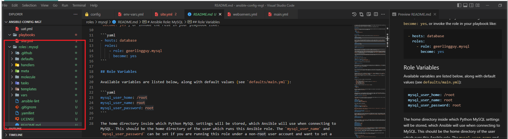

## **ANSIBLE DYNAMIC ASSIGNMENTS (INCLUDE) AND COMMUNITY ROLES**
---

**INTRODUCING DYNAMIC ASSIGNMENT INTO OUR STRUCTURE**


1. In my  https://github.com/<your-name>/ansible-config-mgt GitHub repositor,y i started a new branch and call it `dynamic-assignments`.

2. i Created a new folder, name it `dynamic-assignments`. Then inside this folder, i created a new file and name it `env-vars.yml`. I will instruct `site.yml` to include this playbook later. 

My GitHub now  have the following structure

Note: Depending on what method I used in the previous project I may have or not have `roles` folder in my GitHub repository – if I used ansible-galaxy, then roles directory was only created on my `Jenkins-Ansible` server locally. It is recommended to have all the codes managed and tracked in GitHub, so i might want to recreate this structure manually in this case.

```
├── dynamic-assignments
│   └── env-vars.yml
├── inventory
│   └── dev
    └── stage
    └── uat
    └── prod
└── playbooks
    └── site.yml
└── roles (optional folder)
    └──...(optional subfolders & files)
└── static-assignments
    └── common.yml
```

Since I will be using the same Ansible to configure multiple environments, and each of these environments will have certain unique attributes, such as servername, ip-address etc., I will need a way to set values to variables per specific environment.

For this reason, I will now create a folder to keep each environment’s variables file. Therefore, I created a new folder env-vars, then for each environment, i created new YAML files which I will use to set variables.

My layout now look like this.

```
├── dynamic-assignments
│   └── env-vars.yml
├── env-vars
    └── dev.yml
    └── stage.yml
    └── uat.yml
    └── prod.yml
├── inventory
    └── dev
    └── stage
    └── uat
    └── prod
├── playbooks
    └── site.yml
└── static-assignments
    └── common.yml
    └── webservers.yml
```



Now i pasted the instruction below into the env-vars.yml file.

```
---
- name: collate variables from env specific file, if it exists
  hosts: all
  tasks:
    - name: looping through list of available files
      include_vars: "{{ item }}"
      with_first_found:
        - files:
            - dev.yml
            - stage.yml
            - prod.yml
            - uat.yml
          paths:
            - "{{ playbook_dir }}/../env-vars"
      tags:
        - always
```


## UPDATE SITE.YML WITH DYNAMIC ASSIGNMENTS

I Updated site.yml with dynamic assignments

i Updated `site.yml` file to make use of the dynamic assignment. (At this point, I cannot test it yet.Am  just setting the stage for what is yet to come.)

site.yml should now look like this.

```
---
- hosts: all
- name: Include dynamic variables 
  tasks:
  import_playbook: ../static-assignments/common.yml 
  include: ../dynamic-assignments/env-vars.yml
  tags:
    - always

-  hosts: webservers
- name: Webserver assignment
  import_playbook: ../static-assignments/webservers.yml
```


## Community Roles


Now it is time to create a role for the MySQL database – it should install the MySQL package, create a database, and configure users. But why should I re-invent the wheel? There are tons of roles that have already been developed by other open source engineers out there. These roles are actually production-ready and dynamic to accommodate most Linux flavors. With Ansible Galaxy again, I can simply download a ready-to-use Ansible role and keep going.

Download Mysql Ansible Role

-  I will be using a MySQL role developed by geerlingguy


-  Inside `roles` directory create your new MySQL role with `ansible-galaxy install geerlingguy.mysql -p .` and rename the folder to `mysql`


-  mv geerlingguy.mysql/ mysql


Inside `roles` directory create your new MySQL role with `ansible-galaxy install geerlingguy.nginx -p .` and rename the folder to `nginxRole`


```
mv geerlingguy.nginx/ nginxRole
```


Inside `roles` directory create your new MySQL role with `ansible-galaxy install geerlingguy.apache -p .` and rename the folder to `apacheRole`


```
mv geerlingguy.apache/ apacheRole
```


## LOAD BALANCER ROLES

i want to be able to choose which Load Balancer to use, Nginx or Apache, so i need to have two roles respectively:

1. Nginx
   
2. Apache


## **Important Hints:**

* Since i cannot use both **Nginx** and **Apache** load balancer, i need to add a condition to enable either one – this is where i can make use of variables.

* Declare a variable in `defaults/main.yml` file inside the Nginx and Apache roles. Name each variables `enable_nginx_lb` and `enable_apache_lb` respectively.

* Set both values to false like this `enable_nginx_lb: false` and `enable_apache_lb: false`.

* Declare another variable in both roles `load_balancer_is_required` and set its value to `false` as well

* Update both assignment and site.yml files respectively

`loadbalancers.yml` file
```
- hosts: lb
  roles:
    - { role: nginx, when: enable_nginx_lb and load_balancer_is_required }
    - { role: apache, when: enable_apache_lb and load_balancer_is_required }
```
`site.yml` file
```

     - name: Loadbalancers assignment
       hosts: lb
         - import_playbook: ../static-assignments/loadbalancers.yml
        when: load_balancer_is_required
```
 Now i can make use of `env-vars\uat.yml` file to define which loadbalancer to use in UAT environment by setting respective environmental variable to `true`.

I will activate load balancer, and enable `nginx` by setting these in the respective environment’s env-vars file.

```
enable_nginx_lb: true
load_balancer_is_required: true
```

The same must work with `apache` LB, so I can switch it by setting respective environmental variable to `true` and other to `false`.


I now Run Playbook using:

```
ansible-playbook -i inventory/uat.yml playbooks/site.yml
```


## Project Completed
